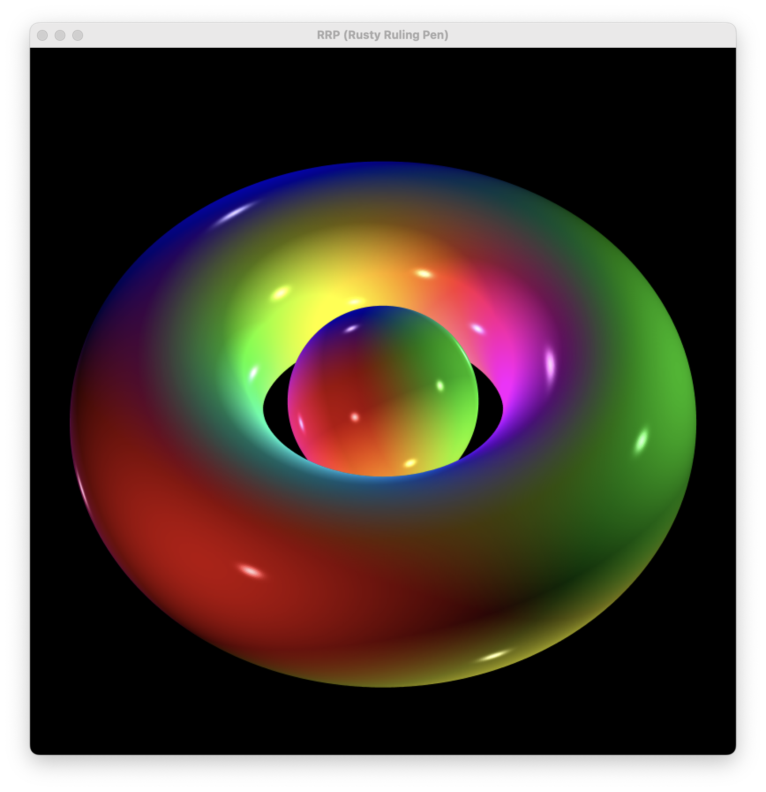

# rusty-ruling-pen

### A simple render engine written solely in rust.

This is first and foremost a passion project. When I started out, my main goal was to learn rust, and it still is. In an
attempt to get a better grasp
both of the language and the algorithms involved with computer graphics, I
implemented almost all data structures, algorithms and vector arithmetic myself. This has been... somewhat successful.

## Data structures:

- Vector2d, -3d, -4d
    - trivial vector structs
    - fields:
        - x: f64
        - y: f64
        - (z: f64)
        - (u: f64)
- IntegerVector2d
    - used during scanline algorithm
    - values in the attrs-vector are interpolated during rasterization
    - current attrs configuration:
        - 0-2: pos in camera space
        - 3: projected z
        - 4-6: normal in camera space
        - 7-10: rgba, each [0.0, ... 1.0]
    - fields:
        - x: i32
        - y: i32
        - attrs: Vec<f64>
- Triangle3d
    - housing shell for 3 vertices
    - on creation, computes surface normal
    - vertex-order determines surface normal
      -fields:
        - vertices: Vec<Vector3d>
        - n: Vector3d
        - color: Color

## Render Pipeline:

- shapes are represented by a Vec\<Triangle3d>
- colors are represented by a Vector4d with the attribute "u" used as alpha channel
- projection
    - projection from 3d to 2d is done using a 4x4 homogenous perspective-projection-matrix
    - during projection, the surface normal and color and projected z of a triangle are transferred into the attrs
      vector
- rasterization:
    - rasterization is done using scanline algorithm
    - during rasterization attrs are interpolated
    - z-buffer for handeling intersecting faces/general z-order
- anti-aliasing:
    - features up to 32x super sampling anti-aliasing
    - since the entire application is single-threaded on CPU, the SSAA is... very, _very_ slow
